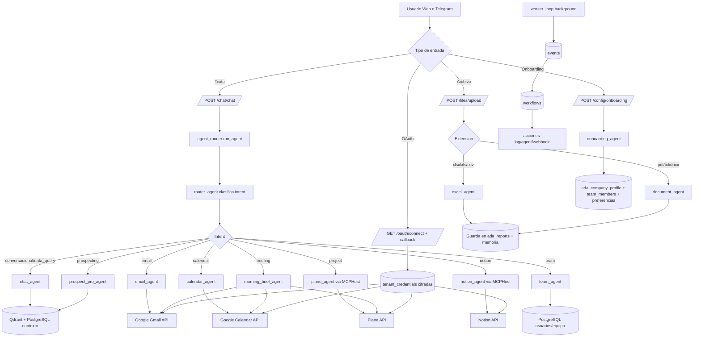

# Analisis Tecnico del Proyecto `ada-langgraph-main`

## 1. Resumen Ejecutivo

Este proyecto implementa una plataforma de asistente ejecutivo con:

- API principal en FastAPI
- Orquestacion de agentes con LangGraph
- Integraciones externas (Gmail, Google Calendar, Notion, Plane, Telegram)
- Memoria semantica en Qdrant
- Persistencia operativa en PostgreSQL (multi-tenant por `empresa_id`)

El flujo central es:

1. Entra un mensaje (web o Telegram)
2. Un `router_agent` clasifica la intencion
3. `agent_runner` enruta al agente especializado
4. El agente consulta fuentes (DB, memoria, APIs externas)
5. Retorna respuesta y, en algunos casos, guarda reportes/artefactos

---

## 2. Arquitectura General

## 2.1 Capa API

Punto de entrada: `api/main.py`

- Inicia FastAPI y CORS
- En `startup` ejecuta:
- `worker_loop()` para procesar eventos en background
- `init_qdrant()` para garantizar colecciones de memoria
- Expone routers de negocio:
- Auth, empresas, usuarios, chat, archivos, onboarding, OAuth, reportes, dashboard, eventos, workflows

## 2.2 Capa de Orquestacion IA

Archivo clave: `api/services/agent_runner.py`

- Recibe mensaje y metadatos (`empresa_id`, `user_id`)
- Ejecuta `router_agent` para detectar intent
- Selecciona agente en `AGENT_REGISTRY`
- Ejecuta el agente final y devuelve:
- respuesta
- intent
- confianza
- agente enroutado
- modelo usado

## 2.3 Capa de Agentes (LangGraph)

Cada agente esta implementado como un `StateGraph`:

- `router_agent`: clasifica intent (calendar, email, data_query, project, etc.)
- `chat_agent`: conversacion + RAG basico (memoria + reportes + contexto personalizado)
- `excel_agent`: pipeline de analisis de archivos tabulares
- `document_agent`: analisis de PDF/TXT/DOCX
- `email_agent`: buscar, leer, redactar y enviar correo
- `calendar_agent`: listar, crear, buscar, eliminar eventos
- `notion_agent` y `plane_agent`: tool-calling via MCPHost
- `team_agent`: gestion de miembros y roles desde chat
- `prospect_pro_agent`: perfilamiento comercial profundo
- `briefing_agent` y `morning_brief_agent`: resumen ejecutivo proactivo
- `onboarding_agent`: configuracion inicial conversacional por pasos

## 2.4 Capa de Datos

PostgreSQL (`scripts/schema.sql`):

- Tenants: `empresas`
- Usuarios y roles: `usuarios`, `team_members`, `user_preferences`
- Integraciones: `tenant_credentials`
- Eventos y automatizaciones: `events`, `workflows`
- Reporteria/knowledge vault: `ada_reports`, `report_links`
- Limites de consumo: `budget_limits`

Qdrant (`api/services/memory_service.py`):

- `agent_memory`: memoria conversacional
- `ada-excel-reports`: embeddings de reportes/documentos

## 2.5 Capa de Integraciones

- Google OAuth por tenant: `api/routers/oauth.py`
- Credenciales cifradas (Fernet) y refresh token: `api/services/tenant_credentials.py`
- Gmail API: `api/services/gmail_service.py`
- Google Calendar API: `api/services/calendar_service.py`
- Notion + Plane via MCPHost: `api/mcp_servers/*`
- Telegram Bot: `bot/telegram_bot.py`
- Voz STT/TTS: `api/services/voice_service.py`

---

## 3. Flujo Funcional Principal

## 3.1 Chat normal (web o Telegram)

1. Cliente llama `POST /chat/chat`
2. Router chat llama `run_agent(...)`
3. `router_agent` clasifica intent con LLM de routing
4. `agent_runner` enruta a agente especializado
5. Agente ejecuta logica:
- puede consultar DB
- puede llamar APIs (Gmail/Calendar/Notion/Plane)
- puede leer memoria/reportes
6. Se retorna respuesta final al cliente

## 3.2 Carga de archivos

Endpoint: `POST /files/upload`

1. Detecta extension y valida tamano
2. Si es Excel/CSV -> `excel_agent`
3. Si es PDF/TXT/DOCX -> `document_agent`
4. Agente analiza, genera output, alerta y guarda en `ada_reports`
5. El resumen se indexa en memoria para consultas futuras

## 3.3 Onboarding (configuracion inicial)

Endpoint: `POST /config/onboarding`

1. Admin responde preguntas por pasos
2. `onboarding_agent` guarda estado temporal en memoria de proceso
3. Al confirmar:
- guarda perfil en `ada_company_profile`
- guarda preferencias del usuario
- crea/actualiza `team_members` admin con permisos completos
- marca usuario como `admin`
4. Desde ese momento, `context_builder` usa ese perfil para personalizar respuestas

## 3.4 Integracion OAuth

1. Admin solicita URL en `/oauth/connect/{service}/{empresa_id}`
2. Autoriza en Google
3. `/oauth/callback` intercambia codigo por tokens
4. Guarda tokens cifrados en `tenant_credentials`
5. Servicios Gmail/Calendar recuperan esas credenciales por `empresa_id`

## 3.5 Eventos y automatizacion

1. Se crean eventos en tabla `events`
2. `worker_loop` (background) consulta eventos pendientes cada 5 segundos
3. Busca workflows activos por `trigger_event`
4. Ejecuta acciones configuradas (`log`, `agent`, `webhook`)
5. Marca evento como procesado

## 3.6 Telegram

1. Usuario hace `/start`
2. Si no esta vinculado, bot pide email y llama `/auth/link-telegram`
3. Luego mensajes de texto van a `/chat/chat`
4. Documentos Excel/CSV van a `/files/upload`
5. Mensajes de voz:
- STT (Gemini)
- procesamiento de chat
- TTS (ElevenLabs)

---

## 4. Diagrama de Flujo General

---

## 5. Componentes Clave por Archivo

- `api/main.py`: bootstrap de API, worker y Qdrant.
- `api/services/agent_runner.py`: enrutador principal de agentes.
- `api/agents/router_agent.py`: clasificacion de intent.
- `api/agents/chat_agent.py`: conversacion con contexto y memoria.
- `api/agents/excel_agent.py`: pipeline de analitica tabular.
- `api/agents/document_agent.py`: pipeline de analisis documental.
- `api/services/memory_service.py`: vector store y busqueda de reportes.
- `api/services/context_builder.py`: contexto personalizado por empresa/usuario.
- `api/services/tenant_credentials.py`: credenciales por tenant + refresh OAuth.
- `api/mcp_servers/mcp_host.py`: puente unico para tools Notion/Plane.
- `api/workers/event_worker.py`: procesamiento asincrono de eventos.
- `bot/telegram_bot.py`: canal conversacional de Telegram.

---

## 6. Observaciones Tecnicas Relevantes

1. Hay piezas en produccion y piezas parcialmente implementadas:
- `POST /api/v1/resume/{thread_id}` tiene `TODO` para reanudar LangGraph real.
- `api/events/event_processor.py` parece legado y no participa en el flujo actual.
- `api/services/ai_gateway.py` existe pero no se usa en el pipeline principal.

2. Hay temas de seguridad para revisar antes de produccion:
- `api/security.py` tiene `SECRET_KEY` hardcodeada.
- `api/main.py` deja CORS abierto con `allow_origins=["*"]`.
- `refresh_token.py` contiene secretos en codigo fuente.

3. El proyecto mantiene mezcla async/sync:
- routers y algunos agentes son async
- servicios y persistencia de agentes usan tambien `sync_engine`
- funciona, pero puede complicar escalabilidad y manejo de errores.

4. El archivo `README.md` no documenta la solucion real (es plantilla generica), por lo que este documento puede servir como base para documentacion oficial.

---

## 7. Conclusion

El sistema esta disenado como una plataforma multiagente orientada a operaciones ejecutivas empresariales. El nucleo funciona alrededor de `agent_runner + router_agent + agentes especializados`, con persistencia en PostgreSQL y memoria semantica en Qdrant. El diagrama anterior representa el flujo real actual del proyecto para chat, analisis de archivos, onboarding, OAuth e integraciones externas.

