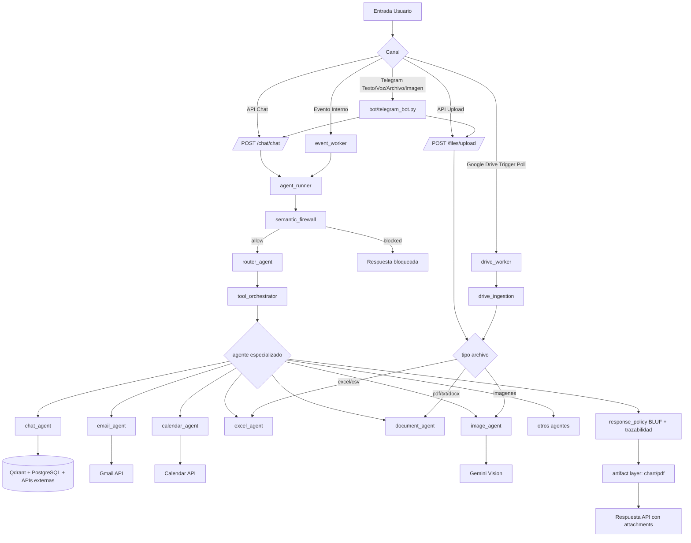
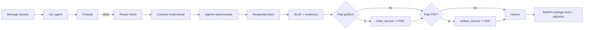

# Analisis Tecnico Actualizado - `ada-langgraph-main`

## 1. Resumen ejecutivo

Este proyecto implementa un asistente multiagente para operaciones de negocio, con:

- API en FastAPI (`api/main.py`)
- Orquestacion con LangGraph (`api/services/agent_runner.py`)
- Memoria semantica y RAG en Qdrant (`api/services/memory_service.py`)
- Persistencia transaccional en PostgreSQL (`api/database.py`)
- Integraciones externas por tenant: Gmail, Calendar, Drive, Notion, Plane
- Canal conversacional en Telegram con soporte multimodal (`bot/telegram_bot.py`)
- Generacion automatica de artefactos (PDF y graficos PNG)

Punto clave: el flujo principal ya no es solo "router por intent". Ahora incluye una capa de seguridad semantica, una capa de orquestacion multi-fuente y una capa de post-procesamiento de respuesta/artefactos.

---

## 2. Arquitectura por capas

## 2.1 Capa de entrada

- API REST:
  - `POST /chat/chat`
  - `POST /files/upload`
  - `POST /config/onboarding`
  - `GET/POST /oauth/*`
  - `GET /panel/dashboard/{empresa_id}`
  - `GET/PATCH /api/v1/reports*`
- Bot Telegram:
  - Texto
  - Voz
  - Documentos
  - Imagenes

## 2.2 Capa de orquestacion IA

`run_agent(...)` (`api/services/agent_runner.py`) aplica este pipeline:

1. Semantic Firewall (bloqueo previo)
2. Router de intent
3. Tool orchestrator multi-fuente (consulta dual obligatoria)
4. Ejecucion de agente especializado
5. Politica de respuesta (BLUF + trazabilidad)
6. Post-proceso de artefactos (grafico/PDF)

## 2.3 Capa de agentes

Agentes relevantes:

- `router_agent`: clasifica intent
- `chat_agent`: RAG conversacional multi-fuente
- `excel_agent`: pipeline analitico tabular
- `document_agent`: analisis documental + semantic tagging
- `image_agent`: vision + semantic tagging + almacenamiento vectorial
- `calendar_agent`: protocolo estricto de operaciones Calendar
- `email_agent`: busqueda/lectura/redaccion/envio Gmail
- `morning_brief_agent`, `briefing_agent`, `team_agent`, `plane_agent`, `notion_agent`, `prospect_pro_agent`

## 2.4 Capa de datos

- PostgreSQL:
  - entidades de negocio (`empresas`, `usuarios`)
  - eventos/workflows (`events`, `workflows`)
  - reportes (`ada_reports`)
  - credenciales tenant (`tenant_credentials`)
  - perfil empresa (`ada_company_profile`)
- Qdrant:
  - `agent_memory`
  - `ada-excel-reports`
  - `vector_store1`
  - `ada-image-reports`

## 2.5 Capa de workers

- `event_worker`:
  - procesa `events` cada 5 segundos
  - dispara acciones de workflows
- `drive_worker`:
  - ingesta automatica desde Google Drive a pipelines de analisis

---

## 3. Flujo funcional principal (chat)

Entrada: `POST /chat/chat` (`api/routers/chat.py`)

1. El router recibe `message`, `empresa_id`, `user_id`, `source`.
2. Llama `run_agent(...)`.
3. `run_agent` evalua firewall semantico.
4. Si pasa, `router_agent` determina `intent` y `routed_to`.
5. `tool_orchestrator` consulta contexto obligatorio:
   - Qdrant Excel Reports
   - Qdrant Vector Store1
   - opcionalmente PostgreSQL reports, Gmail, Calendar, Plane, Notion
6. Se ejecuta el agente final.
7. `response_policy` fuerza:
   - formato BLUF
   - bloque de evidencia (fuente primaria/secundaria + confianza)
8. Post-proceso:
   - si aplica, genera grafico PNG
   - si aplica, genera PDF (con grafico embebido)
9. Respuesta final incluye:
   - `response`
   - `traceability`
   - `attachment` y/o `attachments`

---

## 4. Flujo multimodal de archivos

Entrada: `POST /files/upload` (`api/routers/upload.py`)

Ruteo por extension:

- Excel/CSV -> `excel_agent`
- PDF/TXT/DOC/DOCX -> `document_agent`
- PNG/JPG/JPEG/WEBP/BMP -> `image_agent`

Salida:

- analisis textual
- alertas (si existen)
- persistencia en `ada_reports`
- indexacion vectorial en Qdrant (segun tipo)

---

## 5. Flujo Telegram

Archivo: `bot/telegram_bot.py`

- `handle_text`:
  - valida vinculacion Telegram <-> usuario
  - envia a `POST /chat/chat`
  - publica respuesta
  - si hay `attachments`, envia PDF (documento) y/o grafico (foto)
  - opcional salida en audio (TTS) cuando el usuario lo pide
- `handle_document` / `handle_photo`:
  - envia a `POST /files/upload`
- `handle_voice`:
  - STT -> `POST /chat/chat` -> respuesta + TTS
- Manejo de conflicto Telegram 409 (otra instancia activa)

---

## 6. Flujo OAuth e integraciones por tenant

Archivo: `api/routers/oauth.py`

- `GET /oauth/connect/{service}/{empresa_id}`: genera URL OAuth
- `GET /oauth/callback`: guarda tokens cifrados en `tenant_credentials`
- Soporta Gmail, Google Calendar, Google Drive
- Estado de conexiones por tenant en:
  - `GET /oauth/status/{empresa_id}`
  - `GET /oauth/connections/{empresa_id}`

Servicios consumidores:

- Gmail: `api/services/gmail_service.py`
- Calendar: `api/services/calendar_service.py`
- Drive ingestion: `api/services/drive_ingestion.py`

---

## 7. Flujo de ingesta automatica desde Google Drive

Worker: `api/workers/drive_worker.py`

1. Cada `DRIVE_INGEST_POLL_SECONDS` revisa tenants con `google_drive` activo.
2. Lista archivos de la carpeta `GOOGLE_DRIVE_FOLDER_ID`.
3. Evita reprocesar usando tabla `drive_ingestion_state`.
4. Descarga archivo y despacha a:
   - excel_agent / document_agent / image_agent
5. Marca el archivo como procesado.

Resultado: RAG actualizado automaticamente sin carga manual.

---

## 8. Flujo de eventos y workflows

Worker: `api/workers/event_worker.py`

1. Consulta eventos pendientes en tabla `events`.
2. Busca workflows activos por `trigger_event`.
3. Ejecuta acciones:
   - `log`
   - `agent` (invoca `run_agent`)
   - `webhook` (placeholder de ejecucion)
4. Marca evento como `processed = TRUE`.

---

## 9. Diagrama de flujo global



---

## 10. Diagrama de flujo detallado (chat + artefactos)



---

## 11. Endpoint map (resumen)

- Auth:
  - `POST /auth/login`
  - `GET /auth/telegram/{telegram_id}`
  - `POST /auth/link-telegram`
- Chat:
  - `POST /chat/chat`
- Archivos:
  - `POST /files/upload`
- Dashboard:
  - `GET /panel/dashboard/{empresa_id}` (requiere UUID valido)
- Reports:
  - `GET /api/v1/reports`
  - `GET /api/v1/reports/{report_id}`
  - `GET /api/v1/reports/search/query`
  - `PATCH /api/v1/reports/{report_id}`
  - `POST /api/v1/resume/{thread_id}`
- OAuth:
  - `GET /oauth/connect/{service}/{empresa_id}`
  - `GET /oauth/callback`
  - `GET /oauth/status/{empresa_id}`
  - `GET /oauth/connections/{empresa_id}`
  - `DELETE /oauth/disconnect/{service}/{empresa_id}`
  - `POST /oauth/connect-service`
- Empresas / Usuarios / Team / Onboarding / Events / Workflows:
  - `POST /empresas/`
  - `POST /usuarios/`
  - `GET /usuarios/`
  - `GET /usuarios/team/members`
  - `PATCH /usuarios/team/members/{user_id}`
  - `POST /config/onboarding`
  - `POST /events/`
  - `GET /events/`
  - `POST /workflows/`

---

## 12. Variables de entorno criticas

Minimo para funcionamiento completo:

- `DATABASE_URL`
- `GEMINI_API_KEY`
- `QDRANT_URL`, `QDRANT_API_KEY`
- `FERNET_KEY`
- `GOOGLE_CLIENT_ID`, `GOOGLE_CLIENT_SECRET`
- `TELEGRAM_API` (si usas bot)
- `ELEVENLABS_API_KEY` (si usas TTS)

Control de features:

- `FIREWALL_USE_LLM`
- `ENABLE_DRIVE_INGESTION`
- `DRIVE_INGEST_POLL_SECONDS`
- `GOOGLE_DRIVE_FOLDER_ID`
- `ENABLE_AUTO_INSTALL`
- `ENABLE_AUTO_CHARTS`

---

## 13. Observaciones tecnicas y limites actuales

- No hay frontend web en este repositorio; la raiz `/` devuelve 404 por diseño.
- El dashboard requiere `empresa_id` UUID real.
- `api/security.py` tiene `SECRET_KEY` hardcodeada (deberia ir en env para produccion).
- CORS esta abierto (`allow_origins=["*"]`) en `api/main.py`.
- `api/events/event_processor.py` parece legado y no es el worker principal activo.
- Parte del codigo mezcla operaciones async/sync sobre DB (funciona, pero requiere disciplina operativa).

---

## 14. Guia rapida de ejecucion local

Script recomendado:

```powershell
powershell -ExecutionPolicy Bypass -File .\scripts\start_local.ps1 -Target both
```

Comportamiento:

- Carga `.env`
- Levanta API en puerto libre (si 8000 esta ocupado busca otro)
- Configura `ADA_API_URL` para el bot
- Levanta bot y API juntos

